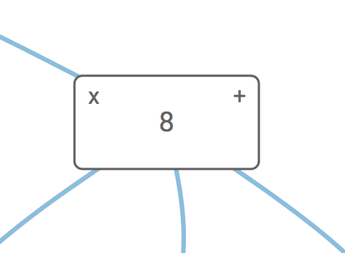

<a id="top"></a>
## Groups Demonstration

This is an example of how to use the Groups functionality.


<a name="package" ref="imports, package, package.json" title="package.json"></a>

```javascript
{
    "dependencies": {
        "font-awesome": "^4.7.0",
        "jsplumbtoolkit": "file:../../jsplumbtoolkit.tgz"
    }
}

```

[TOP](#top)

---

<a name="setup"></a>
### Page Setup

##### CSS

```xml
<link href="node_modules/font-awesome/css/font-awesome.min.css" rel="stylesheet">
<link rel="stylesheet" href="node_modules/jsplumbtoolkit/dist/css/jsplumbtoolkit-defaults.css">
<link rel="stylesheet" href="node_modules/jsplumbtoolkit/dist/css/jsplumbtoolkit-demo.css">
<link rel="stylesheet" href="app.css">  
```

Font Awesome, `jsplumbtoolkit-demo.css`, and `app.css` are used for this demo and are not jsPlumb Toolkit requirements. `jsplumbtoolkit-defaults.css` is recommended for all apps using the Toolkit, at least when you first start to build your app. This stylesheet contains sane defaults for the various widgets in the Toolkit. 

##### JS

```xml
<script src="node_modules/jsplumbtoolkit/dist/js/jsplumbtoolkit.js"></script>
<script src="node_modules/jsplumbtoolkit/dist/js/jsplumbtoolkit-drop.js"></script>
<script src="app.js"></script>
```

We import `jsplumbtoolkit.js` from `node_modules` (it was listed in `package.json`), the UndoManager, and the Drop Manager. `app.js` contains the demo code; it is discussed on this page.

[TOP](#top)

---

<a name="templates"></a>
### Templates

This is the template used to render Nodes: 

```xml
<script type="jtk" id="tmplNode">
    <div style="width:${w}px;height:${h}px;">
        <div class="name">
            <div class="delete" title="Click to delete">
                <i class="fa fa-times"/>
            </div>
            <span>${name}</span>
        </div>
        <div class="connect"/>
        <jtk-source filter=".connect"/>
        <jtk-target/>
    </div>
</script>
```


This is the template used to render Groups:

```xml
<script type="jtk" id="tmplGroup">
    <div>
        <div class="group-title">
            ${title}
            <button class="expand"></button>
        </div>
        <div jsplumb-group-content="true"></div>
    </div>
</script>
```

Group templates can have arbitrary markup as with Node templates. By default, the DOM element representing any Node that is a child of the Group will be appended to the Group's root element. You can, however, mark a place in the Group element that should act as the parent of Node elements - by setting `jsplumb-group-content="true"` on the element you wish to use. In this demo we use that concept to provide a title bar for each Group onto which Node elements can never be dragged.

[TOP](#top)

---

<a name="loading"></a>
### Data Loading

This is the data used by this demonstration:

```javascript
var data = {
    "groups":[
        {"id":"one", "title":"Group 1", "left":100, top:50 },
        {"id":"two", "title":"Group 2", "left":450, top:250, type:"constrained"  }
    ],
    "nodes": [
        { "id": "window1", "name": "1", "left": 10, "top": 20, group:"one" },
        { "id": "window2", "name": "2", "left": 140, "top": 50, group:"one" },
        { "id": "window3", "name": "3", "left": 450, "top": 50 },
        { "id": "window4", "name": "4", "left": 110, "top": 370 },
        { "id": "window5", "name": "5", "left": 140, "top": 150, group:"one" },
        { "id": "window6", "name": "6", "left": 50, "top": 50, group:"two" },
        { "id": "window7", "name": "7", "left": 50, "top": 450 }
    ],
    "edges": [
        { "source": "window1", "target": "window3" },
        { "source": "window1", "target": "window4" },
        { "source": "window3", "target": "window5" },
        { "source": "window5", "target": "window2" },
        { "source": "window4", "target": "window6" },
        { "source": "window6", "target": "window2" }
    ]
};
```

As with Nodes, if you're using the `Absolute` layout, you can specify left/top properties for the element (we have provided these values for every Group and Node but we actually use the `Spring` layout in this demonstration).

Additionally, Groups are considered to have a `type`, just like Nodes, whose default value is `default`, but which can be overridden in the same way as that of Nodes. Here we see the Group 2 is defined to be of type `constrained`, which we will discuss in the [View](#view) section below.

The relationship between Nodes and Groups is written into each Node's data, not into the Group data. Here we see that 4 of the Nodes in our dataset have a `group` declared.


[TOP](#top)

---

<a name="model"></a>
### Model

The Toolkit instance is created with a `groupFactory` and a `nodeFactory`; these are the functions used when a new Group or Node is created after the user drags something on to the canvas:

```javascript
var toolkit = window.toolkit = jsPlumbToolkit.newInstance({
    groupFactory:function(type, data, callback) {
        data.title = "Group " + (toolkit.getGroupCount() + 1);
        callback(data);
    },
    nodeFactory:function(type, data, callback) {
        data.name = (toolkit.getNodeCount() + 1);
        callback(data);
    }
});
```


[TOP](#top)

---

<a name="view"></a>
### View

The view for this demo is:

```javascript
var view = {
    nodes: {
        "default": {
            template: "tmplNode"
        }
    },
    groups:{
        "default":{
            template:"tmplGroup",
            endpoint:"Blank",
            anchor:"Continuous",
            revert:false,
            orphan:true,
            constrain:false,
            layout:{
                type:"Circular"
            }
        },
        constrained:{
            parent:"default",
            constrain:true
        }
    }
};
```

The single Node mapping is the most basic Node mapping possible; Nodes derive their Anchor and Endpoint definitions from
the `jsPlumb` params passed in to the [render call](#rendering) discussed below.  

The Group mappings, though, bear a little discussion. First, the `default` Group mapping:

- *template* - ID of the template to use to render Groups of this type
- *endpoint* - Definition of the Endpoint to use for Connections to the Group when it is collapsed.
- *anchor* - Definition of the Anchor to use for Connections to the Group when it is collapsed.
- *revert* - Whether or not to revert Nodes back into the Group element if they were dropped outside.
- *orphan* - Whether or not to remove Nodes from the Group if they were dragged outside of it and dropped. In actual fact we did not need to set `revert` to false if `orphan` is set to true, but in this demo we included all the possible flags just for completeness.
- *constrain* - Whether or not to constrain Nodes from being dragged outside of the Group's element.
- *layout* - By default, groups have an `Absolute` layout assigned. In this demonstration each group has a `Circular` layout, ie. the nodes inside of it will be laid out in a circle. If you drag a node into or out of a group the layout is reapplied.

The `constrained` Group mapping is declared to extend `default`, so it gets all of the values defined therein, but it overrides `constrain` to be true: Nodes cannot be dragged out of the Group element for this type of Group (in this demo we set Group 2 to be of type `constrained`, and Group 1 - and any Groups dragged on - to be of type `default`).


[TOP](#top)

---

<a name="rendering"></a>
### Rendering

This is the call that sets up the UI:

```javascript
var renderer = toolkit.render({
    container: canvasElement,
    view: view,
    layout: {
        type: "Spring",
        absoluteBacked:false
    },
    jsPlumb: {
        Anchor:"Continuous",
        Endpoint: "Blank",
        Connector: [ "StateMachine", { cssClass: "connectorClass", hoverClass: "connectorHoverClass" } ],
        PaintStyle: { strokeWidth: 1, stroke: '#89bcde' },
        HoverPaintStyle: { stroke: "orange" },
        Overlays: [
            [ "Arrow", { fill: "#09098e", width: 10, length: 10, location: 1 } ]
        ]
    },
    miniview: {
        container:miniviewElement
    },
    lassoFilter: ".controls, .controls *, .miniview, .miniview *",
    dragOptions: {
        filter: ".delete *"
    },
    events: {
        canvasClick: function (e) {
            toolkit.clearSelection();
        },
        modeChanged: function (mode) {
            jsPlumb.removeClass(jsPlumb.getSelector("[mode]"), "selected-mode");
            jsPlumb.addClass(jsPlumb.getSelector("[mode='" + mode + "']"), "selected-mode");
        }
    },
    consumeRightClick:false
});
```

Here's an explanation of what the various parameters mean:

- **container**

This identifies the element into which you wish the Toolkit to render.

- **view**

These are the Node, Port and Edge definitions for this renderer.

- **layout**

Parameters for the layout. Here we specify a `Spring` layout, with `absoluteBacked` set to false. This means that the `left` 
and `top` values for everything is ignored, except for Nodes that are inside Groups, which do not participate in the
layout and are positioned absolute.

- **miniview**

The miniview options provide the the element to convert into a miniview. You can also provide an element ID here.

- **lassoFilter**

This selector specifies elements on which a mousedown should not cause the selection lasso to begin. In this demonstration we exclude the buttons in the top left and the miniview.

- **events**

We listen for two events:

  `canvasClick` - a click somewhere on the widget's whitespace. Then we clear the Toolkit's current selection.
  
  `modeChanged` - Surface's mode has changed (either "select" or "pan"). We update the state of the buttons.

- **jsPlumb**

Recall that the Surface widget is backed by an instance of jsPlumb Community Edition. This parameter sets the [Defaults](/community/doc/defaults.html) for that object.  

[TOP](#top)

---


<a name="selecting"></a>
### Selecting nodes

Lasso selection is enabled by default on the Surface widget. To activate the lasso, click the pencil icon in the toolbar:


The code that listens to clicks on this icon is as follows:

```javascript
// pan mode/select mode
jsPlumb.on(".controls", "tap", "[mode]", function () {
  renderer.setMode(this.getAttribute("mode"));
});
```

The tap listener extracts the desired mode from the button that was clicked and sets it on the renderer. This causes a `modeChanged` event to be fired, which is picked up by the `modeChanged` event listener in the View.

Note that here we could have used a `click` listener, but `tap` works better for mobile devices.

##### Lasso Operation

The lasso works in two ways: when you drag from left to right, any node that intersects your lasso will be selected.  When you drag from right to left, only nodes that are enclosed by your lasso will be selected.


##### Exiting Select Mode

The Surface widget automatically exits select mode once the user has selected something. In this application we also listen to clicks on the whitespace in the widget and switch back to pan mode when we detect one. This is the `events` argument to the `render` call:

```javascript
events: {
  canvasClick: function (e) {
    toolkit.clearSelection();
  }
}
```

`clearSelection` clears the current selection and switches back to Pan mode.

[TOP](#top)

---

<a name="adding"></a>
### Adding new nodes/groups

In this demonstration, new Nodes/Groups are dragged onto the canvas from a sidebar.


This is configured with the following code (the SurfaceDropManager exists from version 1.14.7 onwards; prior to this version this demonstration used to use the `registerDroppableNodes` method of the Surface, which is now removed):

```javascript
new SurfaceDropManager({
    surface:renderer,
    source:document.querySelector(".node-palette"),
    selector:"[data-node-type]",
    dataGenerator:function(e) {
        return {
            type:"default"
        };
    }
});
```

The key thing to note in this demo, as distinct from the other demos, is that the element we drag to add a new Group
has a `jtk-is-group` attribute set:

```xml
<div class="sidebar node-palette">
    <div title="Drag Node to canvas" data-node-type="node" class="sidebar-item">
        <i class="icon-tablet"></i>Drag Node
    </div>
    <div title="Drag Group to canvas" jtk-is-group="true" data-node-type="group" class="sidebar-item">
        <i class="icon-tablet"></i>Drag Group
    </div>
</div>

```

...which is the default way the SurfaceDropManager can tell that a group has been dragged.


For a detailed discussion of this functionality, see [this page](https://docs.jsplumbtoolkit.com/toolkit/current/articles/surface-drop-manager.html).

[TOP](#top)

---

<a name="deleting"></a>
### Deleting nodes/groups



Clicking the **X** button in this demonstration deletes the current node.

```javascript
jsPlumb.on("#canvas", "tap", ".delete *", function (e) {
  var info = toolkit.getObjectInfo(this);
  toolkit.removeNode(info.obj);
});
```

The group elements also have an **X** button. The code to listen to clicks on these is:

```javascript
jsPlumb.on(canvasElement, "tap", ".group-delete", function (e) {
    var info = toolkit.getObjectInfo(this);
    toolkit.removeGroup(info.obj);
});
```

[TOP](#top)


---

<a name="collapsing"></a>
### Collapsing/expanding groups

Clicking the **-** button in this demonstration collapses a Group. It then changes to a +, which, when clicked, expands the Group.

```javascript
jsPlumb.on(canvasElement, "tap", ".group-title button", function(e) {
    var info = toolkit.getObjectInfo(this);
    if (info.obj) {
        renderer.toggleGroup(info.obj);
    }
});
```

The label of the button is changed via css: when a group is collapsed, it is assigned the CSS class `jsplumb-group-collapsed`.
 In the CSS for this demo we have these rules:
 
```css
.group-title button:after {
    content:"-";
}

.jtk-group.jtk-group-collapsed .group-title button:after {
    content:"+";
}
```

Another point to note is that the Toolkit does not take any specific action to "collapse" your Groups visually. It is left
up to you to respond to the `jsplumb-group-collapsed` class as you need to. In this demo, we simply hide the group content
area:

```css
.jtk-group.jtk-group-collapsed [jtk-group-content] {
    display:none;
}
```

[TOP](#top)
